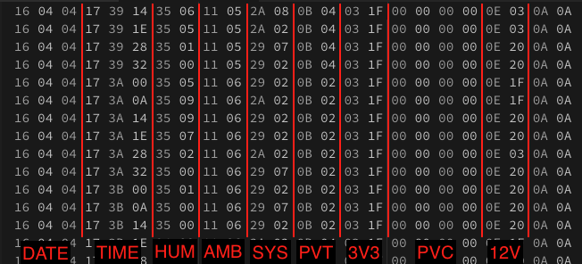

# Okahandja Solar Project

[Back](README.md)

## Uncompressed Syntax:

`DATE,TIME,HUM,AMB,SYS,PVT,V3,PVC,V12`

eg.

`2022-04-11,23:57:20,38.7,18.6,42.2,12.4,3.31,400.5,14.3`

```
DATE   : (10  bytes) 2022-04-11
TIME   : (8   bytes) 23:57:20
HUM    : (3-4 bytes) 38.7
AMB    : (3-4 bytes) 18.6
SYS    : (3-4 bytes) 42.2
PVT    : (3-4 bytes) 12.4
V3     : (3-4 bytes) 3.31
PVC    : (3-5 bytes) 400.5
V12    : (3-4 bytes) 14.3

Commas : (8 bytes) ,
---
TOTAL: 55 bytes max
DAILY: ~460 kilobytes
```

## Compressed Syntax:

Data is annotated in HEX view here:

`16 04 0B 17 39 14 26 07 12 06 2A 02 0C 04 03 03 00 00 0E 03 10 10`

```
DATE : (3 bytes) 16 04 0B       | decimal: 22 04 11
TIME : (3 bytes) 17 39 14       | decimal: 23 57 20
HUM  : (2 bytes) 26 07          | decimal: 38 07
AMB  : (2 bytes) 12 06          | decimal: 18 06
SYS  : (2 bytes) 2A 02          | decimal: 42 02
PVT  : (2 bytes) 0C 04          | decimal: 12 04
V3   : (2 bytes) 03 03          | decimal: 03 31
PVC  : (4 bytes) 00 40 C8 43    | 32-bit float
V12  : (2 bytes) 0E 03          | decimal: 14 03

EOL  : (2 bytes) 0A 0A          | end of line
---
TOTAL: 24 bytes max
DAILY: ~190 kilobytes
---
DIFF : ~59% saved
```


